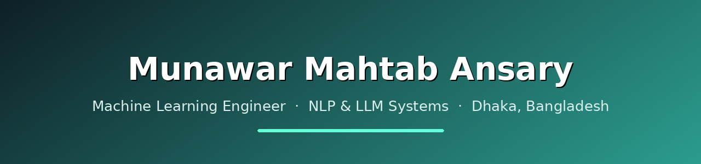

 

## 👋 About Me

I'm a **Machine Learning Engineer** at **Innospace Infotech**, where I shipped **Brritto AI** — a production RAG chatbot — along with OCR and LLM systems that run in production. Alongside that, I'm a **Research Engineer Intern** at **UIU's AIMS Lab**, building **MonCare**, a private, trilingual mental-health support chatbot. I hold a **BSc in Computer Science from BRAC University (CGPA 3.91)**.

I care about **NLP for low-resource languages** (especially Bangla), **retrieval-augmented generation**, and **shipping AI that actually works** — and I'm comfortable across the **full stack** when a project needs it.

- 🤖 Build production **RAG chatbots** and **LLM systems**
- 🧠 Train deep-learning models with **PyTorch** & **Transformers**
- 🗣️ Work on **ASR, translation, and NLP** for Bangla
- ⚙️ Ship full-stack products with **Django** & **Laravel**
- 🌐 Portfolio → **[munawaransary.github.io](https://munawaransary.github.io)**

## 🛠️ Tech Stack

**Languages**

**Machine Learning & Deep Learning**

**LLMs & GenAI**

**Backend & Web**

**Data, Cloud & Tools**

## 🏆 Achievements & Recognition

- 🥈 **11th of 187 teams** — BRACU Intra-University Programming Contest (Team Rocket)
- 🎓 **Vice-Chancellor's List** ×6 semesters & **Dean's List** — BRAC University
- 💰 **50% Merit Scholarship** — BRAC University
- 🗣️ **IELTS 7.0** overall
- 🏅 **Semi-finalist** — Vitalizers 2.0 Business Case Competition
- 🤝 **Volunteer & Organizer** — Muradpur Foundation (health camps & education funding)

## 📊 GitHub Stats

## 🤝 Let's Connect

